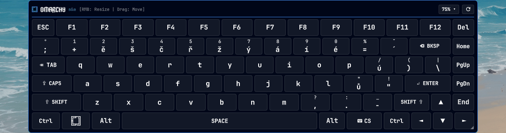

# Virtual Keyboard & Layout (`simonez.vkeyboard`)

[](https://github.com/simonezpx3/omarchy-vkeyboard/releases/tag/v1.6.2)
[](https://github.com/omacom/omarchy)
[](https://wayland.freedesktop.org/)
[](https://omarchyplugins.com/plugin.html?id=simonez.vkeyboard)
[](LICENSE)

An advanced, non-focus-stealing On-Screen Virtual Keyboard (OSK) with instant `wtype` keystroke injection, system shortcut dispatching, dynamic multi-language XKB layout switching, and **Unified CRT Monolithic Grid** styling for Omarchy Linux & Hyprland.

**Authors:** `simonez & Arci`  
**Version:** `1.6.2`  
**License:** MIT  
**Marketplace:** [Published & Verified on Omarchy Plugins](https://omarchyplugins.com/plugin.html?id=simonez.vkeyboard) (Automated Security Baseline: **PASSED**, [Issue #7624](https://github.com/omacom/omarchy-plugin-marketplace/issues/7624))



---

## 1. Core Architecture & Window Focus Resolution

### How the Virtual Keyboard Targets Windows
* **Non-Focus-Stealing Layer-Shell (`WlrKeyboardFocus.None`):**
  * The virtual keyboard runs on `WlrLayer.Overlay` with `WlrKeyboardFocus.None` and `exclusionMode: ExclusionMode.Ignore`.
  * Clicking keys on the virtual keyboard never steals keyboard focus from your active application window. The target window (e.g. Alacritty, Firefox, text editor) stays 100% active, its text cursor continues blinking, and input streams directly into it.
* **Wayland Seat Routing (`zwp_virtual_keyboard_v1` on `wl_seat`):**
  * Keystrokes are injected via the native Wayland virtual keyboard protocol into the current `wl_seat`.
  * The compositor (Hyprland) routes virtual keystrokes to whichever client surface holds active keyboard focus at that moment.

### Interaction with Hyprland's `follow_mouse` Focus Model
* **Default Focus Mode (`follow_mouse = 1` - Focus Follows Mouse):**
  * By default in Omarchy Linux and Hyprland, moving the mouse cursor across an open window immediately gives that window keyboard focus without clicking.
  * When moving the mouse onto the virtual keyboard, because the keyboard explicitly rejects focus (`WlrKeyboardFocus.None`), the keyboard focus stays locked on the window the cursor crossed last.
  * *Tip:* If you hover over Window B on your way to the virtual keyboard, Window B will receive the focus.
* **Click-to-Focus Alternative (`follow_mouse = 2`):**
  * If you prefer switching focus exclusively by explicit mouse clicks (so hovering over windows never changes focus), you can set `follow_mouse = 2` in `~/.config/hypr/input.lua`:
    ```lua
    hl.config({
      input = {
        follow_mouse = 2,
      }
    })
    ```

---

## 2. Key Features

### 󰌌 Bar Indicator & Popout Menu
* **Left Click:** Toggles the full On-Screen Virtual Keyboard on/off.
* **Right Click:** Opens the Quick Settings Panel (aligned with official Omarchy panel architecture):
  * **Dynamic Multi-Layout Detection:** Automatically queries and synchronizes with the system's configured Hyprland XKB layouts (`us`, `cz`, `sk`, `de`, `fr`, `es`, `it`, `pl`, `ua`, `pt`, `nl`, `se`, etc.). Only user-configured system layouts are displayed in the quick-switcher menu, with a clean `English (US)` fallback for unconfigured environments.
  * **6 Hardware Formats:** 60%, 65%, 75%, 80% (TKL), Full Size (with full Numpad), and macOS Layout.
  * **Opacity / Transparency Slider:** Smooth slider (`25%–100%`) with instant live preview.
  * **Header Visibility Toggle:** Option to hide the top header bar for an ultra-clean, minimal borderless layout.

### System Shortcut Dispatcher (`SUPER` combinations)
* Wayland normally isolates virtual keyboards from compositor-level root keybindings for security.
* `simonez.vkeyboard` integrates an intelligent **System Shortcut Dispatcher** via `vkeyboard-ctl dispatch`:
  * Intercepts combinations when `SUPER` is active and resolves them against active Omarchy & Hyprland keybindings.
  * **`SUPER + SPACE`** $\rightarrow$ Application launcher / root menu.
  * **`SUPER + RETURN`** $\rightarrow$ Default terminal emulator.
  * **`SUPER + W`** $\rightarrow$ Close active window (`dispatch killactive`).
  * **`SUPER + F`** $\rightarrow$ Toggle fullscreen window mode.
  * **`SUPER + T`** $\rightarrow$ Toggle floating/tiling window layout.
  * **`SUPER + 1` .. `9`** $\rightarrow$ Switch workspace 1–9.
  * **`SUPER + C / V / X`** $\rightarrow$ Universal copy, paste, cut with automatic terminal detection.
  * **Custom keybindings:** Automatically parses your Hyprland configuration and dispatches any custom user keybindings mapped to `SUPER`.

### Navigation Keys & Double-Shift Protection
* Modernized keysyms: `Page_Up` and `Page_Down` (with fallback for legacy `Prior` / `Next`).
* Pre-sleep delay (`-s 10`) ensuring reliable delivery across Wayland clients.
* Clean text typing: `sendChar()` avoids redundant double-shift modifiers on text characters (`A`, `!`, `1`), preserving exact diacritics and symbols across national layouts.
* Dedicated system hardware keys: `PrtSc` (direct screenshot/OCR capture), `Calc` (`omacalc`), and Volume/Mute controls (`wpctl`).

---

## 3. Installation & Removal

### Standard Installation (Recommended)
```bash
omarchy plugin add https://github.com/simonezpx3/omarchy-vkeyboard.git --enable
```

### Manual Installation from Source
```bash
git clone https://github.com/simonezpx3/omarchy-vkeyboard.git ~/Projects/VirtualKeyboard
cd ~/Projects/VirtualKeyboard
./install.sh
```

### Removal
```bash
omarchy plugin remove simonez.vkeyboard
# or manually via script:
cd ~/Projects/VirtualKeyboard && ./uninstall.sh
```

---

## 4. CLI Control (`vkeyboard-ctl`)

```bash
vkeyboard-ctl status              # Show active layout & system configuration
vkeyboard-ctl switch en          # Switch layout to English (US)
vkeyboard-ctl switch cs          # Switch layout to Czech (if configured)
vkeyboard-ctl toggle             # Toggle between configured system layouts
vkeyboard-ctl dispatch space super    # Dispatch Super+Space system shortcut
vkeyboard-ctl key Page_Up shift       # Send Shift+Page_Up
vkeyboard-ctl text "Hello World"      # Type arbitrary text string
```
